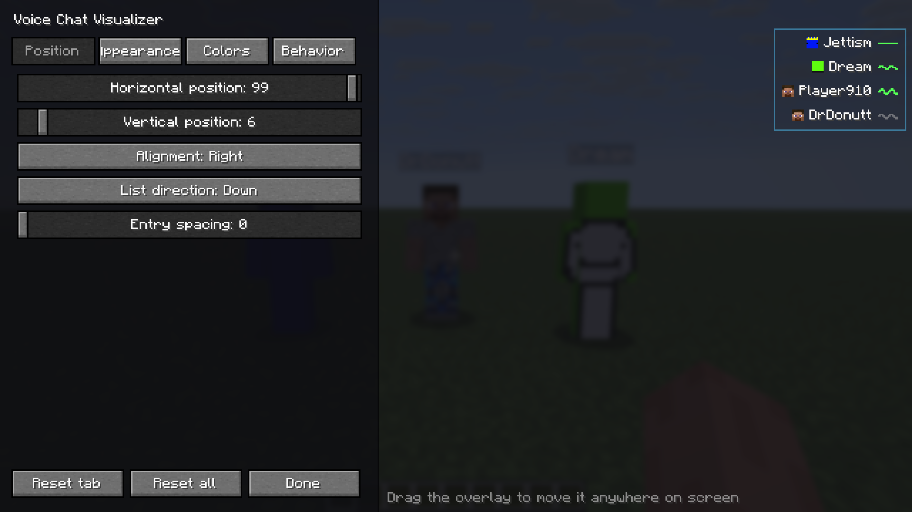
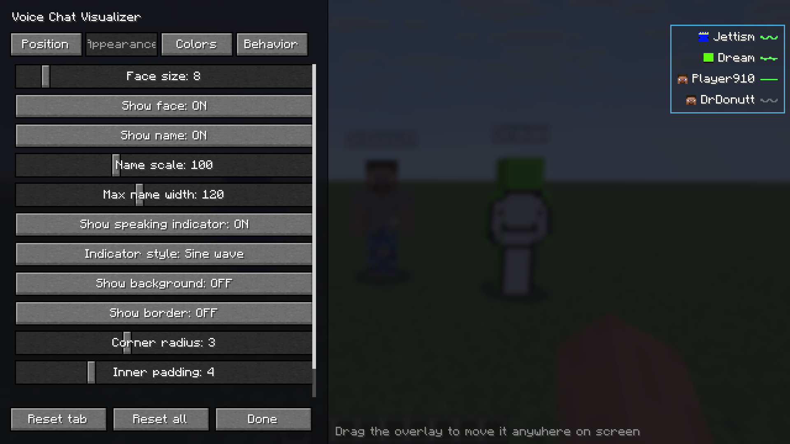
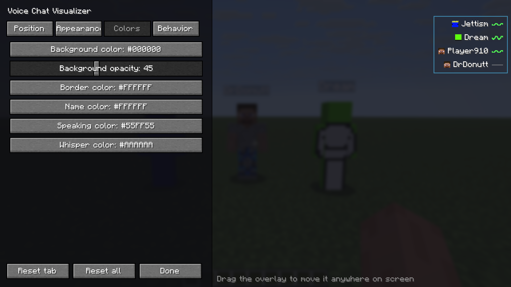

# Voice Chat Visualizer

A **client-side** Fabric mod that adds an on-screen overlay showing **who is currently speaking near
you** in [Simple Voice Chat](https://modrinth.com/plugin/simple-voice-chat): their **face**, **name**
and a live **speaking indicator** (a sine wave that reacts to how loud they talk). When several people
are around you, you instantly see who is talking.

> 📦 **Looking for the mod itself?** This `main` branch only holds the description, licence and
> screenshots — **there is no source code here**. The code for each Minecraft version lives on its
> **own branch** (for example [`1.21.11`](../../tree/1.21.11)), and every version has its own build
> under [Releases](../../releases). See [Supported versions](#supported-versions) below.

---

## Features

- **Live speaker overlay** — face + name + animated indicator for everyone you can currently hear.
- **Reacts to loudness** — the waveform pulses with the speaker's actual volume, not just on/off.
- **All voice modes** — proximity, locational and group (static) audio.
- **Only real players** — audio routed through plugin/add-on channels (radios, music, non-player
  entities) never shows up as a "ghost" entry.
- **Fully draggable HUD** — put it anywhere on screen, align left/right, list grows up or down.
- **In-game configurator** — tabs for **Position**, **Appearance**, **Colors** and **Behavior**, with
  **HSV + hex color pickers** and a **live preview** using sample speakers, so you can tune everything
  solo without a second player online.
- **Smart layout** — the settings panel automatically moves to the **opposite side** of the overlay, so
  it never covers the element you're positioning.
- **Deeply customizable** — face size (down to 4 px), name scale & max width, background & border,
  corner radius, padding, distance display, max entries, fade in/out, hold time, slide-in animation,
  loudness sensitivity, sort order, whisper marking, "show myself", and indicator style
  (**wave / bars / dot**).
- **Keybinds** — open the configurator (default **V**) and toggle the overlay.
- **Mod Menu** integration.
- **English and Polish** translations built in.

## Screenshots

**Position** — drag the overlay anywhere on screen; the settings panel moves to the opposite side.

**Appearance** — face size, name scale, indicator style, background and border.

**Colors** — HSV + hex colour pickers for every part of the overlay.

## How it works

The mod hooks into the Simple Voice Chat plugin API and listens (read-only) to the audio you receive.
For every voice packet you hear it shows that player in the overlay and fades them out shortly after
they stop — so the list always reflects **who is actually talking near you**. Names and skins come from
the tab list, so they stay correct even for players behind a wall.

## Requirements

- **Fabric Loader** and **[Fabric API](https://modrinth.com/mod/fabric-api)**
- **[Simple Voice Chat](https://modrinth.com/plugin/simple-voice-chat)** — the server must run it, as usual
- **[Mod Menu](https://modrinth.com/mod/modmenu)** *(optional — adds a Configure button)*

> **Client-side only.** You do not need to install this on the server; the server just needs Simple
> Voice Chat like normal.

## Supported versions

This branch (`main`) holds only the description, licence and screenshots. **The mod's source code lives
on a branch per Minecraft version**, and each version has its own release.

| Minecraft | Source branch | Download |
|---|---|---|
| 1.21.11 | [`1.21.11`](../../tree/1.21.11) | [Releases](../../releases) |

## Installation

1. Install Fabric Loader.
2. Drop **Fabric API**, **Simple Voice Chat** and this mod's `.jar` into your `mods` folder — make sure
   you pick the jar that matches your Minecraft version.
3. Join a server that uses Simple Voice Chat.
4. Press **V** (default) — or open **Mod Menu → Voice Chat Visualizer → Configure** — to customize the
   overlay.

## Configuration

Open the configurator with the keybind or via Mod Menu. **Drag** the overlay preview anywhere on
screen, pick colors, sizes and behavior, and watch it update live. Everything is saved to
`config/svc-visualizer.json`. Use **Reset tab** or **Reset all** to go back to defaults.

## License

MIT — see [LICENSE](LICENSE).
